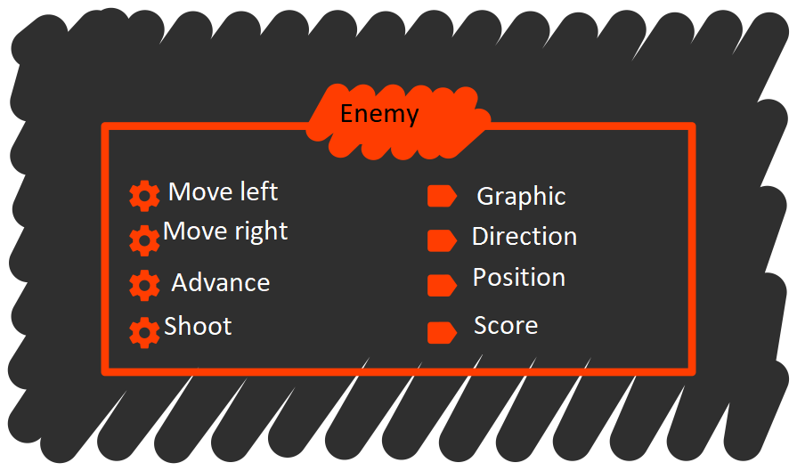

# The JavaScript data model

Knowing a programming language basically means that we know its syntax, data model, execution model, and idioms.

Throughout this lesson, [you will code into JavaScript what you learned in the prior lesson](../0201-poo/).

Not all languages allow a 1:1 translation of the concepts we have included in the model. For instance, JavaScript does not feature any mechanisms that allow for the creation of new types, but it does feature other mechanisms that allow for the implementation of a similar functionality.

## Experimenting with JavaScript

You are going to be experimenting with JavaScript, so you will need a quick way of inspecting expressions and obtaining feedback on what you are doing. The best way is to use the **Node console**. For instance:

```sh
$ node --use_strict
```

The option `--use_strict` enables JavaScript's strict mode, which simplifies some aspects of the language. Strict mode cuts back on some features, but its benefits outweigh its drawbacks.

Now you can try to insert some expressions:

```sh
> 40 + 2
42
> var point = { x: 1, y: 1 };
undefined
> point
{ x: 1, y: 1 }
> point.x
1
```

In order to clear the screen, press `ctrl+l`. To exit Node, press `ctrl+c` twice in succession. If Node seems to be unresponsive while typing an expression, press `ctrl+c` once to cancel the expression.

If you would rather not put up with the Node console, you can always write a program and use `console.log()` in order to display expressions on screen.

```js
// in file test.js
console.log(40 + 2);
var point = { x: 1, y: 1 };
console.log(point);
console.log('Coordinate X:', point.x);
```

Now run the program with Node:

```sh
$ node test.js
42
{ x: 1, y: 1 }
Coordinate X: 1
```

This lesson assumes you will be using a single Node console session, unless otherwise specified.

You can keep the same session logged on for most of the examples, but in the case that you find anything unexpected, you should try restarting the console before doing anything else. In order to restart the console, you have to **exit and enter again**.

It would be best for you to keep this text opened up in a window (or printed out), and the Node console on another.

## Primitive types

**Primitive types** is how we call types that come built into the language and allow for the creation of newer, more complex types. The primitive types in JavaScript are: **boolean**, **number**, **string**, **object**, and **function.**

```js
// You can find more possible values for each of the types in the comments.
var bool = true; // false
var number = 1234.5; // 42, -Infinity, +Infinity
var text = 'I want to be a pirate!'; // "I want to be a pirate"
var object = {}; // [], null
var code = function () { return 42; };
```

You can tell them from others because they respond differently to the `typeof` operator. Notice how the types are text strings:

```js
typeof true;
typeof 1234.5;
typeof 'I want to be a pirate!';
typeof {};
typeof function () { return 42; };
```

In JavaScript, it is possible to declare a variable without assigning a value to it. In this case, the variable's type would be `'undefined'`.

```js
var x;
typeof x;
x = 5; // as soon as we give it a value, its type will cease to be undefined.
typeof x;
```

### Objects in JavaScript

From among all the types, we shall pay special attention to those whose values allow **compositing** with other values. These are of the `'object'` type.

In JavaScript, objects are collections of tagged values. For instance, if we want to represent the point `(10, 15)` in the XY plane, we can tag the value on the Y axis with the string `'x'`, and the value on the Y axis with the `'y'` string.

```js
var point = { 'x': 10, 'y': 15 };
```

Every tag/value pair is called an **object property.** In a less strict way of speaking, when we discuss an object's **properties**, we are usually referring to values, while what we usually mean by a **property name** is a tag.

If property names are written according to the JavaScript [identifier forming rules](https://developer.mozilla.org/en-US/docs/Glossary/Identifier), the quotes are unnecessary and can be skipped.

```js
var point = { x: 10, y: 10 }; // much more convenient.
```

This is the most frequent case, the _recommended_ one, and the one we shall use throughout this material; however, you should remember that under the hood, **the property name is a string.**

In order to access a property of an object, we use the brackets `[` `]` with the property name in between:

```js
point['x'];
point['y'];
```

Again, if we follow the identifier forming rules, we can use the (much easier to write) **dot notation** to access the property:

```js
point.x;
point.y;
```

We use the assignment operator to change the value of a property:

```js
point.x = 0;
point.y = 0;
point['x'] = 0;
point['y'] = 0;
```

If you access a **non-extant property**, you will obtain the value `undefined`:

```js
var label = point.label; // will be undefined. Check it out with typeof.
```

We can create new properties at any time by assigning a value to them.

```js
point.label = 'origin';
point;
```

### Arrays

**Arrays** are collections of **ordered data**.

Consider the command list in a videogame menu:

```js
var menu = ['Attack', 'Defense', 'Inventory'];
```

In this type of objects, order matters. Accessing the different values is done by using the **item's index in the array**, between brackets. Indices _begin from `0`_, and not from `1`.

```js
menu[0];
menu[1];
menu[2];
```

We can check an array's length by accessing its `length` property.

```js
menu.length;
```

Items can be added to the array's end by calling the [`push`](https://developer.mozilla.org/en/docs/Web/JavaScript/Reference/Global_Objects/Array/push) method:

```js
menu.push('Magic');
```

An item can also be removed from the end by using the [`pop`](https://developer.mozilla.org/en-US/docs/Web/JavaScript/Reference/Global_Objects/Array/pop) method:

```js
menu.pop();
```

An array can be altered (have items added or removed from it) in any place by using the [`splice`](https://developer.mozilla.org/en-US/docs/Web/JavaScript/Reference/Global_Objects/Array/splice) method:

```js
// Inspect the list after every operation.
menu = ['Attack', 'Defense', 'Inventory'];
menu.splice(2, 0, 'Magic'); // add Magic before Inventory.
menu.splice(2, 2, 'Ench. Inventory'); // replace Magic and Inventory with Ench. Inventory.
menu.splice(0, 0, 'Wait'); // add Wait to list beginning.
```

As is the case with objects, we can change any value at any time by using the assignment operator.

```js
menu[0] = 'Special'; // replace Wait with Special
```

Again, as with objects, we can access a non-extant value and retrieve or assign it at any time.

```js
menu;
menu.length;
var item = menu[10];
typeof item; // will be undefined.
menu[10] = 'Secret';
menu;
menu.length;
```

If we assign to an index beyond the current length, **the array will be extended** until that index is included.

#### Making a distinction between objects and arrays

Both arrays and objects have the `'object'` type, therefore it is necessary to use the [`Array.isArray()`]( https://developer.mozilla.org/en-US/docs/Web/JavaScript/Reference/Global_Objects/Array/isArray) method to tell them apart.

```js
var obj = {}; // the void object is as valid as any other.
var arr = []; // an empty list.
typeof obj; // will be object.
typeof arr; // will be object.
Array.isArray(obj); // will be false.
Array.isArray(arr); // will be true.
```

### `null`

There is another last value for the object type, which is `null`. This value represents the **absence of an object**, and it normally has the following uses:

- In functions that query about an object, to indicate that the object has not been found.

- In compositing relationships, to indicate that the composite object no longer needs the compositing object.

For instance, in an RPG, we can query about the next living enemy in order to check whether the battle has to keep going:

```js
function getNextAliveEnemy() {
  var nextEnemy;
  if (aliveEnemies.length > 0) {
    nextEnemy = aliveEnemies[0];
  }
  else {
    nextEnemy = null;
  }
  return nextEnemy;
}
```

Or, in another example, consider a hero's character sheet:

```js
var hero = { sword: null, shield: null };
hero.sword = { attack: 20, magic: 5 }; // take a sword.
hero.sword = null; // drop a sword.
```

### Object compositing

Objects and arrays allow any compositing of objects. That is to say, their values can be other objects, arrays, numbers, strings or functions.

The following example shows a possible RPG character sheet:

```js
var hero = {
  name: 'Link',
  life: 100,
  weapon: { kind: 'sword', power: 20, magicPower: 5 },
  defense: { kind: 'shield', power: 5, magicPower: 0 },
  // Inventory in slots. Two empty slots and another with 5 potions.
  inventory: [
    { item: null, count: 0},
    { item: null, count: 0},
    { item: { kind: 'potion', power: 15 }, count: 5}
  ]
};
```

Some properties:

```js
hero.name; // hero's name
hero.weapon.kind; // type of weapon
hero.inventory[0]; // first inventory slot
hero.inventory[0].item; // what is in the first inventory slot
hero.inventory[2].item.power; // power level of the item in the third inventory slot
```

## Identity of objects

In JavaScript, the equality operator is `===` (triple equal). This allows us to compare two objects and decide whether **they are equal**. There is also the inequality operator `!==`, which compares two objects and decides whether **they are not equal**.

For the types `'bool'`, `'string'`, `'number'` & `'undefined'`, two values are equal if they are [of the **same shape**](https://developer.mozilla.org/en-US/docs/Web/JavaScript/Reference/Operators/Comparison_Operators):

```js
// All of these comparisons are true.
"Hola" === "Hola";
"Hola" !== "hola";
true === true;
123 === 123.0;
123 !== "123";
123 === 122 + 1; // the expression is first solved, then compared.
undefined === undefined;
```

For the `object` type, two objects are equal only if they refer to the same object:

```js
({} !== {}); // regardless of the shape, these are two different objects.
({} !== []);
[] !== []; // same as before.
[1, 2, 3] !== [1, 2, 3]; // regardless of the shape, the objects are different.
null === null; // but with null it works, since there is only one null value.
var obj = {};
var sameObj = obj;
var another = {};
sameObj === obj; // it works because both names refer to the same object.
sameObj !== another; // like before, different despite the same shape.
```

## Objects and message passing

JavaScript objects and the ability to use code as a value like any other allow us to codify the concepts of _object_ and _message passing_ from object-oriented programming.

### Codifying the state

With everything we have seen until now, you should have enough knowledge to codify the state. The **attribute set** of the object in the object-oriented model translates into the **property set** of JavaScript objects.

In the _Space Invaders_ example, the state of enemies comprised of:



Can be codified as:

```js
var enemy = {
  graphic: 'specie01.png',
  currentDirection: 'right',
  position: { x: 10, y: 10 },
  score: 40
};
```

The foremost limitation to JavaScript is that **access to object properties cannot be restricted** (i.e., there are no private properties). Because of this, there is nothing to prevent us from directly modifying the position.

```js
enemy.position.x = 100; // perfectly valid.
```

At most, we could warn the user against code that handles certain properties. A widespread practice in JavaScript is to add an underscore `_` to attributes we want to consider to be **private:**

```js
var enemy = {
  _graphic: 'specie01.png',
  _currentDirection: 'right',
  _position: { x: 10, y: 10 },
  _score: 40
};
```

We insist, however, that this is only a conventionality and underscore-marked attributes can be accessed regardless:

```js
enemy._position.x = 100; // also perfectly valid.
```

### Codifying the API

The actions an object's API is comprised of, i.e. its **methods**, can be implemented as **functions** inside properties of the object.


```js
var enemy = {
  _graphic: 'specie01.png',
  _currentDirection: 'right',
  _position: { x: 10, y: 10 },
  _score: 40,

  moveLeft: function () { console.log('Going left!'); },
  moveRight: function () { console.log('Going right!'); },
  advance: function () { console.log('Marching forward!'); },
  shoot: function () { console.log('PEW!'); } // (it's a laser)
};
```

**Sending a message** to an object simply means accessing the target's property, which will be a function, and calling it.

```js
enemy.shoot(); // first we access with dot, then call with ().
enemy.moveLeft();
enemy.moveLeft();
enemy.advance();
enemy['shoot'](); // it is the same if we access with brackets and call with ().
```

Any function can behave as a method. In order to have it act as a method, all we need is **to call it from an object's property**. And, just like any other object property, we can change it at any time:

```js
enemy.shoot(); // PEW!
enemy.shoot = function () { console.log('VOIP!'); };
enemy.shoot(); // VOIP!
```

Now then, notice the following behavior:

```js
enemy; // notice the position.
enemy.moveLeft();
enemy; // notice the position again.
```

Obviously, from just a glance at what `moveLeft` does, we would be unable to tell that it _changes the state_ of the message's target object. How can we fix this?

Since any function can behave as a method, what we need is a way of **referring to the message's target**, if there is one. When used as a method, the target is always stored to the variable **`this`**.

Thanks to this variable, we can implement the following movement methods:

```js
enemy.moveLeft = function () { this._position.x -= 2; };
enemy.moveRight = function () { this._position.x += 2; };
enemy.advance = function () { this._position.y += 2; };
```

Try the same experiment as before and notice how we are, effectively, changing
the object's state.

```js
enemy; // notice the position.
enemy.moveLeft();
enemy; // notice the position again.
```

### The value of `this`

The value of `this` is one of JavaScript's most debated aspects.

In other languages, methods and functions are different things and a method
_always_ has one -and only one- associated object, so `this` never changes.

But in JavaScript, `this` depends on how we call the function: whether we call
it as a function, or as a method.

Consider the following function:

```js
function inspect() {
  // only inspects this
  console.log('Type:', typeof this);
  console.log('Value:', this);
}
```

And try the following:

```js
// before trying each example, consider what might the value of this be.
var ship1 = { name: 'T-Fighter', method: inspect };
var ship2 = { name: 'X-Wing', method: inspect };
ship1.method();
ship2.method();
inspect();
```

In the latter case, the value of `this` is `undefined` because the function is not being used as a method, so there is no target.

In JavaScript, we can make a function take any object as its `this`. To do this, we shall use [`apply`](https://developer.mozilla.org/es/docs/Web/JavaScript/Referencia/Objetos_globales/Function/apply) on a function.

```js
var onlyNameShip = { name: 'Death Star' };
inspect.apply(onlyNameShip); // makes the value of this be onlyNameShip for inspect.
```

[`This`](http://dmitrysoshnikov.com/ecmascript/javascript-the-core/#this-value) is also known as the **context object**, and we shall use this term occasionally throughout these materials.

## Additional considerations

### Names and values

**A variable is a name.** Names are meaningless to the program, save for some exceptions.

**A value is not a name.** In fact, only functions can be named so that we can implement recursivity, as well as a couple extra things.

Therefore, the name `one` and the value `1` are not the same thing; and of course, there is no obligatory coherent relationship between name and value.

```js
var uno = 2; // makes sense to the program, maybe not so much to the programmer.
```

Generally speaking, when dealing with booleans, strings and numbers, we say that **names store values;** while when speaking about objects and functions we say that **names point** to objects or functions, or that they **reference** objects or functions.

### Functions, references to functions and calls to functions

There are two ways of defining a function. One is to use the **function declaration**, `function`:

```js
// introduces a factorial variable which points to the factorial function.
function factorial(number) {
  if (number === 0) {
    return 1;
  }
  return number * factorial(number - 1);
} // no semicolon ';' needed in this case.
```

In this case, the name of the function (before the parentheses) is mandatory. Giving a name to a function has two implications:

- It allows the implementation of **recursive calls**, like the one in the example.

- **It creates a name**, `factorial`, to refer to that function by.

The other way is to use a **function expression.** This is more similar to the way we would create other values, such as numbers or strings:

```js
// Introduces a recursiveFunction variable that points to ANOTHER factorial function.
var recursiveFunction = function factorial(number) {
  if (number === 0) {
    return 1;
  }
  return number * factorial(number - 1);
}; // now we do need a semicolon, just as in any other assignment.
```

In this last case, there are two names. One is the name of the function `factorial`, which exists so that we can refer to it within the function's body. The other is the `recursiveFunction` variable, which references the function.

The same function can be referenced by multiple variables or, put another way, have many names:

```js
var a = recursiveFunction;
var b = recursiveFunction;
a === b; // true, they refer to the same function.
a.name; // the function name has nothing to do with that of the variable.
b.name; // same.
recursiveFunction !== factorial;
```

Neither should we confuse the reference to the function `factorial` and the call to the same function, for example, `factorial(10)`.

The first expression **refers to the object** that encapsulates the code to be run. It requires no parameters because **what we want is not to run the code**, but to refer to the function.

With the second expression, **we are asking the function to be executed** and, therefore, all necessary parameters have to be provided.

### Everything is an object in JavaScript

If, according to an alternate definition, we consider an object to be anything that may respond to a message, then it results that **everything is an object** in JavaScript.

Notice the following examples:

```js
true.toString();
3.1415.toFixed(2);
'I want to be a pirate!'.split(' ');
({}).hasOwnProperty('x');
(function (parameter) { return parameter; }).length;
```

## Types and object constructors

As we said before, JavaScript does not allow for the modeling of new types, which necessitates a "workaround." This is one of its key differences with other object-oriented languages.

What we do is sidestep the notion of _type_ altogether, in order to directly broach the **_constructor_** concept.


We are going to create two constructor functions: one for points, another for shots.

```js
function newPoint(x, y) {
    var obj = {};
    obj.x = x;
    obj.y = y;

    return obj;
}

function newShot(position, velocity) {
    var obj = {};
    obj._position = position;
    obj._velocity = velocity;
    obj.advance = function () {
        this._position.y += this._velocity;
    };

    return obj;
}
```

Constructor functions are very similar in form: they create a void object, set the object's properties and return the new object.

Now we would be able to create shots with something like this:

```js
// Positive velocity for downward movement.
var enemyShot = newShot(newPoint(15, 15), 2);

// Negative velocity for upwards movement.
var allyShot = newShot(newPoint(15, 585), -2);

enemyShot !== allyShot;
```

### Reusing functionality

The problem with this approach is that we are creating different functions for identical behaviors: one function per object.

```js
var s1 = newShot(newPoint(15, 15), 2);
var s2 = newShot(newPoint(15, 15), 2);
var s3 = newShot(newPoint(15, 15), 2);
s1.advance !== s2.advance;
s2.advance !== s3.advance;
s3.advance !== s1.advance;
```

This is highly inefficient, since every function takes up its own space in memory.

There is no need for so many functions, but rather only one, affecting several objects.

Therefore, it is best to **create an object that contains only the API:**

```js
var shotAPI = {
    advance: function () {
        this._position.y += this._velocity;
    }
};
```

And use it in the object's creation so that it borrows the API's methods:

```js
function newShot(position, velocity) {
    var obj = {};
    obj._position = position;
    obj._velocity = velocity;
    obj.advance = shotAPI.advance;
    return obj;
}
```

Now all instances share the same function, but every function affects the corresponding object, thanks to the value of `this`:

```js
var s1 = newShot(newPoint(15, 15), 2);
var s2 = newShot(newPoint(15, 15), 2);
var s3 = newShot(newPoint(15, 15), 2);
s1.advance === s2.advance; // now they ARE the same.
s2.advance === s3.advance;
s3.advance === s1.advance;
```

In order to further strengthen the association between constructor and API, we shall perform a minor modification: creating the object with the API as a **property of the constructor function**, thereby grouping everything in the same place (the `newShot` function).

```js
function newShot(position, velocity) {
    var obj = {};
    obj._position = position;
    obj._velocity = velocity;
    obj.advance = newShot.api.advance;
    return obj;
}

// A function is an object, so we can add a property to it.
newShot.api = {
    advance: function () {
        this._position.y += this._velocity;
    }
};
```

## The prototype chain

JavaScript has a signature feature, unique to the language: the **prototype chain.**

You can experiment with it in [Object Playground]( http://www.objectplayground.com/), an excellent tool that will help you visualize it.

The idea is not too complicated: the prototype chain is a **property search list.** Every item in the chain is the **prototype** of the prior item.

When you access a property of an object, this property is looked up in the object and if it is not found, it is looked up in the object's prototype, and so on until either the property or the chain's end are reached.

For instance:

```
obj1                    obj2               obj3
{ a: 1, b: 2, c: 3} --> { d: 4, e: 5 } --> { f: 6 }
obj1.c -------↑           ↑                  ↑
obj1.d -------------------|                  |
obj1.f --------------------------------------|
obj1.z ------------------------------------------------X
```

Creating this hierarchy in JavaScript requires the use of [`Object.create()`]( https://developer.mozilla.org/es/docs/Web/JavaScript/Referencia/Objetos_globales/Object/create):

```js
// The chain is assembled from rear to front.
var obj3 = { f: 6 };
// Chaining obj2 to obj3
var obj2 = Object.create(obj3);
obj2.d = 4;
obj2.e = 5;
// Chaining obj1 to obj2
var obj1 = Object.create(obj2);
obj1.a = 1;
obj1.b = 2;
obj1.c = 3;

obj1.c;
obj1.d;
obj1.f;
obj1.z; // undefined
```

The method `Object.create()` creates a new void object (like `{}`) whose prototype is the object we passed as a parameter.

The method [`hasOwnProperty`]( https://developer.mozilla.org/en/docs/Web/JavaScript/Reference/Global_Objects/Object/hasOwnProperty) can be used to determine whether a property belongs to an object without having to go through the prototype chain:

```js
obj1.hasOwnProperty('c'); // true
obj1.hasOwnProperty('d'); // false
obj1.hasOwnProperty('f'); // false
obj1.hasOwnProperty('z'); // false

obj2.hasOwnProperty('c'); // false
obj2.hasOwnProperty('d'); // true
obj2.hasOwnProperty('f'); // false
obj2.hasOwnProperty('z'); // false

obj3.hasOwnProperty('c'); // false
obj3.hasOwnProperty('d'); // false
obj3.hasOwnProperty('f'); // true
obj3.hasOwnProperty('z'); // false
```

The method [`Object.getPrototypeOf()`]( https://developer.mozilla.org/en-US/docs/Web/JavaScript/Reference/Global_Objects/Object/getPrototypeOf) can be used to obtain an object's prototype:

```js
Object.getPrototypeOf(obj1) === obj2;
Object.getPrototypeOf(obj2) === obj3;
Object.getPrototypeOf(obj3) === Object.prototype;
Object.getPrototypeOf(Object.prototype) === null;
```

## Constructors and prototype chains

Prototypes are uniquely suited to contain the API, which is the common behavior to all objects of a given type.

```
var obj = newShot()                               newShot.api
{ _position: { x: 10, y: 10 }, _velocity: 2 } --> { advance: function ... };
obj._position.y ------↑                             ↑
obj.advance ----------------------------------------|
obj.goBack ------------------------------------------------------------------X
```

In order to establish this link, we shall modify our constructor as follows:

```js
function newShot(position, velocity) {
    // With this, the API is the object's prototype.
    var obj = Object.create(newShot.api);
    obj._position = position;
    obj._velocity = velocity;

    return obj;
}

newShot.api = {
    advance: function () {
        this._position.y += this._velocity;
    }
};
```

Now try creating a new shot:

```js
var shot = newShot({x: 0, y: 0}, 2);
shot; // on inspecting shot, only the object's properties are shown.
shot.advance; // but advance exists in its prototype.
shot.hasOwnProperty('advance'); // false
Object.getPrototypeOf(shot).hasOwnProperty('advance'); // true
```

If we do this for all constructors, we shall soon come across a pattern:

1. Create an object to contain the API.

2. Implement the API as properties of this object.

3. Within the constructor, make this object be the prototype to a new object.

4. Establish the properties of the new object with the state.

5. Return the new object.

Only steps 2 and 4 involve differences between this constructor and any others, the rest is exactly the same. So much so that JavaScript takes note of it, and comes with built-in mechanisms to automatize steps 1, 3 and 5.

First of all, JavaScript allows for _any function_ to be used as a constructor. Because of this, everytime we type a function, JavaScript creates a **property of the function called "prototype"**, which is an object with a single property, `constructor`, that points to the function.

```js
function anyFunction() {}
anyFunction.prototype;
anyFunction.prototype.constructor === anyFunction;
```

This automatizes step 1: no longer do we need the `api` object that we would manually set. The `prototype` property is equivalent to the `api` property.

Now, upon calling the function with the operator `new` first, **a new object whose prototype is precisely the function's "prototype" property** is created:

```js
var obj = new anyFunction();
var anotherObj = new anyFunction();

// The objects are different.
obj !== anotherObj;

// But their prototypes are the same.
Object.getPrototypeOf(obj) === Object.getPrototypeOf(anotherObj);

// Furthermore, they are the function's "prototype" property.
Object.getPrototypeOf(obj) === anyFunction.prototype;
```

With this, step 3 is automatized: it is no longer necessary to call `Object.create()` in order to establish the prototype chain between object and API (we get this automatically by using the `new` operator.)

Finally, by calling it with `new`, **the function receives as its context object (`this`) the element that is being created**, which allows us to set its attributes.

```js
function Hero(name) {
    this.name = name;
    this.sword = null;
    this.shield = null;
}

var hero = new Hero('Link');
hero;
```

If the function returns nothing, **the result of the operator `new` will be the new object.** This automatizes step 5: returning the new object is no longer necessary, as this return is implicit to using `new`.

Notice what the constructor for a point object would look like:

```js
function Point(x, y) {
    this.x = x;
    this.y = y;
}
```

As for the shot:

```js
function Shot(position, velocity) {
    this._position = position;
    this._velocity = velocity;
}

// The prototype does already exist, but we are adding the method advance() to it
Shot.prototype.advance = function () {
    this._position.y += this._velocity;
};
```

Now, creating the objects is a matter of using `new`. We will also use our new type, `Point`, to pass the position to the shot:

```js
var enemyShot = new Shot(new Point(15, 15), 2);
var allyShot = new Shot(new Point(15, 585), -2);
enemyShot !== allyShot;
```

## Inheritance

We have seen how objects with attributes are created; also how to do it efficiently, by using constructors and the prototype chain.

Now we shall see how an **inheritance relationship** is created. Remember the example for enemies and the player ship in the prior lesson:


We will need our points and shots:

```js
function Point(x, y) {
    this.x = x;
    this.y = y;
}

function Shot(position, velocity) {
    this._position = position;
    this._velocity = velocity;
}

Shot.prototype.advance = function () {
    this._position.y += this._velocity;
};
```

The constructor and the methods for the enemies could be:

```js
function Enemy(graphic, position, score) {
    this._graphic = graphic;
    this._currentDirection = 'right';
    this._position = position;
    this._score = score;
}

Enemy.prototype.moveLeft = function () { this._position.x -= 2; };
Enemy.prototype.moveRight = function () { this._position.x += 2; };
Enemy.prototype.advance = function () { this._position.y += 2; };

Enemy.prototype.shoot = function () {
    var firePosition = new Position(this._position.x, this._position.y + 10);
    var shot = new Shot(firePosition, 2);
    return shot;
};
```

And here, the implementation for the allied ship:

```js
function Ally(position) {
    this._graphic = 'ally.png';
    this._position = position;
}

Ally.prototype.moveLeft = function () { this._position.x -= 2; };
Ally.prototype.moveRight = function () { this._position.x += 2; };

Ally.prototype.shoot = function () {
    var firePosition = new Position(this._position.x, this._position.y - 10);
    var shot = new Shot(firePosition, -2);
    return shot;
};
```

Now we can generalize and think of a constructor that envelopes the properties that are common to both types:

```js
function Ship(graphic, position) {
    this._graphic = graphic;
    this._position = position;
}

Ship.prototype.moveLeft = function () { this._position.x -= 2; };
Ship.prototype.moveRight = function () { this._position.x += 2; };
```

In this case, it is probably best not to include the `shoot` method, since some ships shoot upwards and others downwards. We will not include `advance` either, as it is exclusive to enemies.


Keep in mind that, from now on, the constructors for both the allied ship and the enemies will first ask the ship constructor to create a ship, and then customize it.

```js
function Enemy(graphic, position, score) {
    Ship.apply(this, [graphic, position]);
    this._currentDirection = 'right';
    this._score = score;
}

function Ally(position) {
    Ship.apply(this, ['ally.png', position]);
}
```

With [`apply`](https://developer.mozilla.org/es/docs/Web/JavaScript/Referencia/Objetos_globales/Function/apply) we can execute a function specifying its context object, as well as its parameters.

With the previous configuration, all new instances of enemies and allies will first go through the `Ship` constructor, which will set the **common attributes;** these instances will then be modified individually by the relevant constructor, in order for them to become enemies or allies.

As for the API, it would be ideal to have a prototype chain after the following fashion:

- Enemy (or ally) attributes are included in the instance itself.

- The specific API for the `Enemy` or `Ally` types is in the `prototype` property of that type's constructor.

- The API common to the `Enemy` and `Ally` types is in the `prototype` property of the `Ship` constructor.

```
var enemy = new Enemy()             Enemy.prototype      Ship.prototype
{ _position: ..., _score: ... } --> { advance: ... } --> { moveLeft: ... }
enemy._score -----↑                   ↑                    ↑
enemy.advance ------------------------|                    |
enemy.moveLeft --------------------------------------------|
```

As was the case for the example in the previous section, it is necessary to create the chain from the rear to the front. The link between instances and constructors is provided by JavaScript upon using `new`, but the link between the `prototype` property from `Enemy` and from `Ship` **has to be manually set.**

Try the following:

```js
// Inspect Enemy's prototype.
Enemy.prototype;

// Link both prototype properties.
Enemy.prototype = Object.create(Ship.prototype);

// Inspect the prototype property again and scans for differences.
Enemy.prototype;

// Correct the constructor property.
Enemy.prototype.constructor = Enemy;

// Add the method specific to the type Enemy.
Enemy.prototype.advance = function () {
    this._position.y += 2;
};

// Another specific method.
Enemy.prototype.shoot = function () {
    var firePosition = new Point(this._position.x, this._position.y + 10);
    var shot = new Shot(firePosition, 2);
    return shot;
};
```

And for the `Ally` type:

```js
// The same for the ally.
Ally.prototype = Object.create(Ship.prototype);
Ally.prototype.constructor = Ally;

Ally.prototype.shoot = function () {
    var firePosition = new Point(this._position.x, this._position.y - 10);
    var shot = new Shot(firePosition, -2);
    return shot;
};
```

Now we can finally create an enemy and an ally by using their constructors:

```js
var enemy = new Enemy('enemy1.png', new Point(10, 10), 40);
var ally = new Ally(new Point(10, 590));

Object.getPrototypeOf(ally) === Ally.prototype;
Object.getPrototypeOf(enemy) === Enemy.prototype;
Ally.prototype !== Enemy.prototype;
Object.getPrototypeOf(Ally.prototype) === Object.getPrototypeOf(Enemy.prototype);
Object.getPrototypeOf(Ally.prototype) === Ship.prototype;
```

We can also check where every property is:

```js
enemy.hasOwnProperty('_score');
enemy.hasOwnProperty('advance');
enemy.hasOwnProperty('moveLeft');

Enemy.prototype.hasOwnProperty('_score');
Enemy.prototype.hasOwnProperty('advance');
Enemy.prototype.hasOwnProperty('moveLeft');

Ship.prototype.hasOwnProperty('_score');
Ship.prototype.hasOwnProperty('advance');
Ship.prototype.hasOwnProperty('moveLeft');
```

## Polymorphism

The inheritance relationships we have just established allow us to say that an enemy is an instance of the `Enemy` type, but also of the `Ship` type. **A given instance can have multiple shapes, thanks to inheritance.** In object-oriented programming this is called **polymorphism.**

Alternately, we can say an enemy is an instance of `Enemy` because it has the `Enemy` API, or that it is an instance of `Ship` because it has the `Ship` API. This is equivalent to saying that the `prototype` properties of `Enemy` and `Ship` are in the object's prototype chain.

The `instanceof` operator returns true if the `prototype` property of the function to the operator's right is in the prototype chain of the object to the left of the operator.

```js
enemy instanceof Enemy;  // Enemy.prototype is the first link.
enemy instanceof Ship;   // Ship.prototype is the second.
enemy instanceof Object; // Object.prototype, the third.

enemy instanceof Ally;   // Ally.prototype is not in the chain.
```

Regarding the state, it is convenient to know which constructor has built the object, so that we can know at a glance which attributes it will contain. This is equivalent to determining which is the function whose `prototype` property is the **first link** in the prototype chain.

Given that the prototype objects come with a built in `constructor` property, which by default points to the function which owns the prototype object, all we need is to access the `constructor` property through the instance.

```js
enemy.constructor;
enemy.constructor === Enemy; // it was built by Enemy, not by Ship.
enemy.constructor !== Ship; // it is true that Ship was used, but nothing else.
```

### Duck typing

> In other words, don't check whether it IS-a duck: check whether it
> QUACKS-like-a duck, WALKS-like-a duck, etc, etc, depending on exactly what
> subset of duck-like behaviour you need to play your language-games with.

[Alex Martelli on polymorphism]( https://groups.google.com/forum/?hl=en#!msg/comp.lang.python/CCs2oJdyuzc/NYjla5HKMOIJ)

The quote refers to how it is not so much a matter of checking whether something is an instance of a type, as rather checking whether it has the necessary functionality.

JavaScript is so dynamic that the `instanceof` operator and the `constructor` property only make sense if the conventions we have just covered are followed.

Nothing prevents us from deleting the `constructor` property from a prototype or overwriting it in a specific object. As a matter of fact, in the newer versions of JavaScript, an object's prototype can change after the object's construction.
