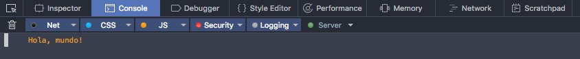
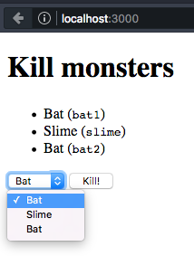
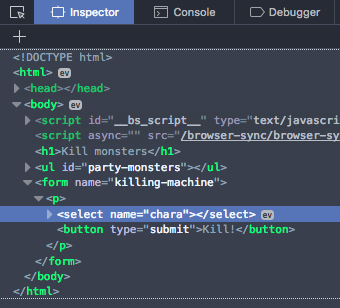
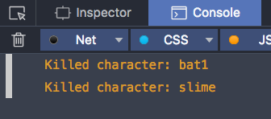
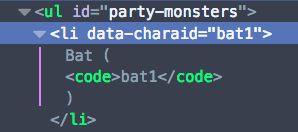

# Exercises

Complete these exercises in order and try to answer the proposed questions.

Remember you can always look up the documentation (for instance), [the MDN](http://developer.mozilla.org)), search the Internet, etc.

**Important**: each exercise will as you to create an HTML file, a JavaScript and possibly a CSS one. **You must create new files**, not reuse the ones for previous exercises. If you want to keep the exercise files, you can create a different directory for each.

## Exercise 1. Execute JavaScript on the browser

Create an `index.html` file with the following content:

```html
<html>
<head>
    <title>Exercises</title>
    <meta charset="utf-8">
    <script src="main.js"></script>
</head>
<body>
</body>
</html>
```

Create `main.js` too (you may notice we include it from the HTML file, with the `<script>` tag) with the following:

```javascript
console.log("Hello, world!");
```

Open the file in the browser, and you will see it shows up blank, since the HTML is empty. But if we open the **browser console**, we can see the message we have written from the JavaScript file.

In Firefox Developer Edition, you can open up the development tools with `Ctrl + Shift + I` (or `⌘ + ⌥ + I` ), or from the menu `Tools / Web Developer / Toggle Tools`. Several panels will show up with different tools, among them the **console**, which you can enable by clicking on its tab.



Now we shall modify the HTML dynamically so that written text will show on screen.

Add the following to the JavaScript file, `main.js`:

```javascript
document.body.innerHTML = '<h1>Hello, world!</h1>';
```

Then try reloading… and the page still shows up blank! However, if we replace the previous line with the following block, the problem is fixed:

```javascript
window.onload = function () {
    document.body.innerHTML = '<h1>Hello, world!</h1>';
};
```


---

**Question**: Why does this happen?

Resources:

- [`window.onload`](https://developer.mozilla.org/en/docs/Web/API/GlobalEventHandlers/onload) (MDN)

## Exercise 2. Summoning a horde of cats

This exercise consists of creating an image on the fly on the press of a button, and adding it to the page.

Create an `index.html`:

```html
<html>
<head>
    <title>Exercises</title>
    <meta charset="utf-8">
    <script src="main.js"></script>
</head>
<body>
    <h1>Fear the horde!</h1>
    <p><button type="button" id="summon">Summon cat</button></p>
    <p id="kittens"></p>
</body>
</html>
```

Now for `main.js`. First, we shall check for clicks on the button:

```javascript
window.onload = function () {
    var button = document.getElementById('summon');
    button.addEventListener('click', function () {
        console.log('Summon!');
    });
};
```

Execute the code on the browser, and check whether the `Summon!` message shows up on the console.

Once we have detected the event, we shall dynamically create an image and then add it to the DOM so that it displays on screen. Replace the content of the callback function (the line that was printed out on the console) with the following:

```javascript
var img = new Image();
img.src = 'https://placekitten.com/g/200/200/';
document.getElementById('kittens').appendChild(img);
```

Check out whether a new image is inserted with each click on the button:


---

**Exercises**: instead of creating an `Image` object, modify the code so that it directly inserts HTML as paragraph content with `id` `kittens`.

Resources:

- [`Element.innerHTML`](https://developer.mozilla.org/en-US/docs/Web/API/Element/innerHTML) (MDN)
- [``](https://developer.mozilla.org/en-US/docs/Web/HTML/Element/img) (MDN)

Considerations:

- Keep in mind `innerHTML` is both a read property and a write property.
- You can concatenate strings by using the `+` operator. E.g.: `'hello, ' + 'world'`.
- In this case, using `Image` yields no advantage over creating the object via HTML. `Image` is usually employed when we need to subscribe to an event of the image (e.g., `load`), or we need to access its properties via JavaScript.

## Exercise 3. Styles, forms and custom attributes

In this exercise, we shall display a list of characters and use a form to select which of them we want to "kill". Additionally, we shall display dead characters with a different appearance.

### Step 1. Setup

We shall start from the following HTML file:

```html
<!doctype html>
<html>
<head>
    <title>Ejercicios</title>
    <meta charset="utf-8">
    <link rel="stylesheet" href="styles.css" type="text/css">
    <script src="main.js"></script>
</head>
<body>
    <h1>Kill monsters</h1>
    <ul id="party-monsters">
    </ul>
    <form name="killing-machine">
        <p>
            <select name="chara"></select>
            <button type="submit">Kill!</button>
        </p>
    </form>
</body>
</html>
```

We shall also create `styles.css`, containing the following:

```css
.dead {
    text-decoration: line-through;
}
```

### Step 2. Inserting content dynamically

We shall perform this step with JavaScript, from a `main.js` file. What we shall do is fill in the character list with the data from a **party**, as well as customizing the form's dropdown controls (the `<select>`) so that it too can display the character list.

We shall first create the party data. For instance:

```javascript
var party = [
    {name: 'Bat', id: 'bat1'},
    {name: 'Slime', id: 'slime'},
    {name: 'Bat', id: 'bat2'}
];
```

With this we can now fill in the list, `<ul>`:

```javascript
window.onload = function () {
    var list = document.getElementById('party-monsters');
    party.forEach(function (character) {
        var li = document.createElement('li');
        li.innerHTML = character.name + ' (<code>' + character.id + '</code>)';
        list.appendChild(li);
    });
};
```

In order to add "lines" to the dropdown controls, that is to say the `<select>`, we must use `<option>` elements. The text contained in the tag will be the one that displays on the menu. However, in order to know the selected _value_, we need to add a `name` attribute to `<option>`, and this string is the one the `<select>` element will return when we ask it which option is the one it currently has selected.

This would be the sample HTML for a `<select>` (do not copy it, it is just an example):

```html
<select name="size">
    <option value="size-s">Small</option>
    <option value="size-m">Medium</option>
    <option value="size-l">Large</option>
</select>
```

Should the user select the option `Medium`, `<select>` would return the value `size-m` when asked about the selected option.

Now that we know this, we shall generate a `<select>` containing the characters in the party. We shall use their names as the display text, and their ID as the value for that option.

```javascript
var select = document.querySelector('select[name=chara]');
party.forEach(function (character) {
    var option = document.createElement('option');
    option.innerHTML = character.name;
    option.value = character.id;
    select.appendChild(option);
});
```

If you run the code, you shall see the following:



Visually, everything looks alright, but we are going to make sure all of the `<option>`s effectively have the `value` we want.

To this end, right-click on the `<select>` and select the `Inspect Element` element from the context menu. The developer tools will open up (if they were not already), with the Inspector as active panel.



Click the arrow on the left to unfold the content of that DOM node:


Check whether the `value`s are the right ones.


### Step 3. Intercepting the form

Try selecting a character and hitting the _Kill_ button. You will see that the page reloads, but the URL is a bit different:


What is happening here is that a question mark, followed by the names of the form's fields with their values, has been added. In this case we can see `chara=slime` because our `<select>` porque nuestro `<select>` has the `name` attribute set to `chara`, while `slime` is the `value` for the selected option.

This string (`?chara=slime`) is known as **querystring**, and its purpose is to pass request parameters to the server. We are not programming a server, and only want to obtain the form's value in order to perform an action _on our side_ (that of the Web client).

This is fixed by intercepting the `submit` event from the form and cancelling it so that the browser will not make a new request to the server, reloading the page:

```javascript
var form = document.querySelector('form[name=killing-machine]');
form.addEventListener('submit', function (event) {
    event.preventDefault();
    console.log('Killed character');
});
```

Notice how the button no longer reloads the page, but rather prints out a message on the console.

Now we shall retrieve the character's ID by looking up the value selected on `<select>`. To do this, all we need to do is access its `value` property. Replace the callback in `submit` with the following:

```javascript
event.preventDefault();
var charaID = form.querySelector('[name=chara]').value;
console.log('Killed character:', charaID);
```

In the console, notice how the ID is different depending on the option that is selected.




### Step 4. Data attributes for element mapping

In this step, we shall add a CSS class to the appropriate element of the list when we kill its corresponding character, thereby marking it dead.

What can we do so as to relate the selected value to another HTML node?

One thing we could do is add an ID attribute to the elements of the list, and then use `getElementById` in order to select that element and manipulate it. The problem is, **IDs must be unique**. It would serve us for this particular example, but what if we need to render the same party on another part of the page?

The solution is to _make up_ an **HTML attribute of our own invention** and store the character's ID there (or any other value we like). We can add one or more custom attributes to any HTML tag; the only requirement would be for them to have **the prefix, `data-`**. Thus, we would have elements rendered as follows:

```html
<li data-charaid="bat1">...</li>
```

We could thus access this element by using `querySelector('[data-chara-id=bat1]')`, for instance.

These attributes are called _data attributes_. We can access them from JavaScript with the `dataset` property, which contains a map on which the names of the attributes (_without_ the prefix `data-`) would be the _keys_. In this example, `li.dataset.charaid` would return `bat1` (assuming that `li` were the `<li>` element we wanted).

We must first add this data attribute when filling in the list:

```javascript
var li = document.createElement('li');
li.innerHTML = character.name + ' (<code>' + character.id + '</code>)';
li.dataset.charaid = character.id;
list.appendChild(li);
```

You can check whether the attribute is correctly set by using the inspector:



Now, modify the callback in `submit` as follows:

```javascript
event.preventDefault();
var charaID = form.querySelector('[name=chara]').value;
var li = list.querySelector('[data-charaid=' + charaID + ']');
li.classList.add('dead');
```

This way, every time we push the button the CSS class `dead` is added to the `<li>` element which contains the selected character. On the CSS file `styles.css` we have already created a rule that displays elements of the `dead` class with   Con esto, cada vez que se pulse el botón se añade la clase CSS `dead` al elemnto `<li>` que contenga el personaje seleccionado. En el archivo CSS `styles.css` hemos creado antes una regla que muestra a los elementos con clase `dead` in strikethrough:


---

**Exercise**: try disabling the kill button if the selected option on `<select>` is a character that is already dead.

- Disable the button as soon as the character is dead, setting the `disabled` option of `<button>` to `true`.
- Subscribe to the `change` event of `<select>`, which fires whenever the selected value changes.
    1. Find out whether the corresponding character's `<li>` has the `dead` class. To do this, use the appropriate method from the [`classList` property](https://developer.mozilla.org/en/docs/Web/API/Element/classList).
    2. Change the `disabled` property of `<button>` according to whether the character is living or dead.

Resources:

- [`Event.preventDefault`](https://developer.mozilla.org/en-US/docs/Web/API/Event/preventDefault) (MDN)
- [Using data attributes](https://developer.mozilla.org/en/docs/Web/Guide/HTML/Using_data_attributes) (MDN)
- [`Element.classList`](https://developer.mozilla.org/en/docs/Web/API/Element/classList) (MDN)


Notes:

- We can use `querySelector` on any element of the DOM, not only `document`. In this case, we shall restrict the search to its children.

## Exercise 4. Party status

Now we shall proceed to draw the status of the party of characters from the previous practice on a `<canvas>`.

### Step 1. Adapt the previous exercise

Modify your HTML file to change the title, the button text and include a `<canvas>` element as we show below:

```html
<!doctype html>
<html>
<head>
    <title>Exercises</title>
    <meta charset="utf-8">
    <link rel="stylesheet" href="styles.css" type="text/css">
    <script src="main.js"></script>
</head>
<body>
    <!-- Change the title! We are going to kill the monsters, but we will take our time. -->
    <h1>Attack the monsters!</h1>
    <canvas width="800" height="600"></canvas>
    <ul id="party-monsters">
    </ul>
    <form name="killing-machine">
        <p>
            <select name="chara"></select>
            <!-- We have also changed the button text. -->
            <button type="submit">Hit!</button>
        </p>
    </form>
    <section class="resources">
      
    </section>
</body>
</html>
```

Modify the CSS file too, so as to add the following rule and hide the images:

```css
.resources {
  display: none;
}
```

To wrap things up, open the `main.js` file and modify the party to include their hit points:

```javascript
var party = [
    {name: 'Bat', id: 'bat1', hp: 10, maxHp: 20},
    {name: 'Slime', id: 'slime', hp: 50, maxHp: 50},
    {name: 'Bat', id: 'bat2', hp: 5, maxHp: 20}
];
```

Modify the callback in `submit` as follows, so that instead of outright killing them it deals a 5 hit point attack against them:

```javascript
event.preventDefault();
var charaID = form.querySelector('[name=chara]').value;
var character = findCharById(charaID);
character.hp -= 5;

if (character.hp <= 0) {
    character.hp = 0; // adjust the value in case it is negative.
    var li = list.querySelector('[data-charaid=' + charaID + ']');
    li.classList.add('dead');
}
```

The `findCharById` function will look like this:

```javascript
function findCharById(charaID) {
    return party.filter(function (char) { return char.id === charaID; })[0];
}
```

Now you will need to click more than once to destroy an enemy. You can use the debugger to see how the enemies lose their hit points with each click.

### Step 2. The rendering loop

What we shall do now is implement a very simple rendering loop. As we have already seen in the theory, we cannot do anything like:

```javascript
while (true) {
    renderParty();
}
```

The reason being that we would lock the main thread up, leaving the page disabled. What we need to do is program a frame-by-frame render by using `requestAnimationFrame`. Add the following within the `onload` function:

```js
var lastRender = 0;
var canvas = document.querySelector('canvas');
var context = canvas.getContext('2d');

function render() {
    requestAnimationFrame(function (t) {
        // Delete it all...
        context.clearRect(0, 0, 800, 600);
        // ...and redraw.
        renderParty();
        console.log('Delta time:', t - lastRender);
        lastRender = t;
        render();
  });
}

function renderParty(t) {
    console.log('Time to draw the party: ', t);
}

render();
```

Check out the console output. **What does the number it prints out stand for?**

### Step 3. Drawing the background

Now we shall sketch out what it means to draw the party. That is easy enough. Change the code of `renderParty` so that it looks like this:

```javascript
function renderParty(t) {
    renderBackground();
    renderCharacters(t); // pass t to the function that draws enemies.
    renderUI();
}

var bgImage = document.getElementById('background');
function renderBackground() {
    console.log('Drawing the background.');
}

function renderCharacters(t) {
    console.log('Drawing the characters.');
}

function renderUI() {
    console.log('Drawing the interface.');
}
```

**Note**: be extremely careful about using `console.log` within rendering functions. Doing this 60 times per second can degrade the application's performance if you have the developer tools open.

Now let us draw the background. Change the `renderBackground` function so that it only includes the following code:

```js
context.drawImage(bgImage, 0, 0)
```

### Step 4. Drawing the enemies

We will use graphical primitives to draw the enemies. The "slime" will be a green circle, while the bat will be a blue circle. If any of the characters is dead, we will draw them in grey. Delete the log and modify the `renderCharacters` function so that it includes:

```javascript
var charaSpace = 800 / party.length;
var centerOffset = charaSpace / 2;
party.forEach(function (char, index) {
    var x = index * charaSpace + centerOffset;
    var y;
    if (char.hp === 0) {
        context.fillStyle = 'grey';
        y = 500; // on the ground because character is dead.
    } else if (char.name === 'Bat') {
        context.fillStyle = 'blue';
        y = 50 * Math.sin(t/100) + 300; // floating in the air.
    } else if (char.name === 'Slime') {
        context.fillStyle = 'green';
        y = 400; // on the ground, but not in the grave.
    }
    context.beginPath();
    context.arc(x, y, 50, 0, 2 * Math.PI);
    context.fill();
});
```

### Step 5. Drawing the UI

We still need to draw some life bars right beneath each enemy. To do this, replace the contents of the `renderUI` function with the following:

```javascript
var width = 100;
var semiWidth = width / 2;
var height = 20;
var semiHeight = height / 2;
var charaSpace = 800 / party.length;
var centerOffset = charaSpace / 2;

party.forEach(function (char, index) {
    var x = index * charaSpace + centerOffset;
    var y = 500;
    if (char.hp > 0) {
        var lifeArea = Math.floor(char.hp / char.maxHp * width);
        context.fillStyle = 'red';
        context.fillRect(x - semiWidth, y - semiHeight, lifeArea, height);
        context.lineWidth = 3;
        context.strokeStyle = 'black';
        context.strokeRect(x - semiWidth, y - semiHeight, width, height);
    }
});
```

---

**Exercise**: modify the `hp` in the `party` list so that they are maxed out, and make it so that whenever they are hit, the bar will animate from its prior value to the new one.

Resources:

- [requestAnimationFrame](https://developer.mozilla.org/en-US/docs/Web/API/window/requestAnimationFrame)
- [`CanvasRenderingContext2D.clearRect`](https://developer.mozilla.org/en-US/docs/Web/API/CanvasRenderingContext2D/clearRect)
- [`CanvasRenderingContext2D.fillRect`](https://developer.mozilla.org/en-US/docs/Web/API/CanvasRenderingContext2D/fillRect)
- [`CanvasRenderingContext2D.fillStyle`](https://developer.mozilla.org/en-US/docs/Web/API/CanvasRenderingContext2D/fillStyle)
- [`CanvasRenderingContext2D.strokeRect`](https://developer.mozilla.org/en-US/docs/Web/API/CanvasRenderingContext2D/strokeRect)
- [`CanvasRenderingContext2D.strokeStyle`](https://developer.mozilla.org/en-US/docs/Web/API/CanvasRenderingContext2D/strokeStyle)
